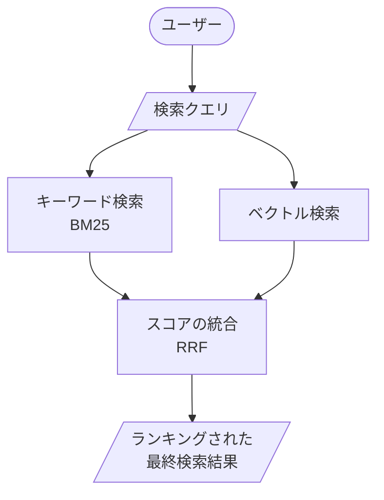

## はじめに
 目標は、無料でハイブリッドRAG(全文検索+ベクトル検索)を構築することです。
 この記事では、「何を使ったか」「どう動かすか」「どんな結果が出るか」だけをシンプルにまとめます。

## 目次
- [やりたいこと](#やりたいこと)
- [完全無料でハイブリッドRAGを構築できる理由](#完全無料でハイブリッドragを構築できる理由)
- [ハイブリッドRAGとは](#ハイブリッドragとは)
- [ディレクトリ構成](#ディレクトリ構成)
- [セットアップ](#セットアップ)
- [インデックス作成](#インデックス作成)
- [検索とRAG実行](#検索とrag実行)
- [実行結果の例](#実行結果の例)
- [重要なポイント](#重要なポイント)
- [まとめ](#まとめ)
- [以下実装内容をもう少し解説](#以下実装内容をもう少し解説)

## やりたいこと

- ローカルで動く **完全無料のハイブリッドRAG** を作る
- 社内PDFなどをテキスト化して、
  - キーワード検索（BM25）
  - ベクトル検索（Embedding）
  を組み合わせて、精度の高い検索＋要約をしたい

### 完全無料でハイブリッドRAGを構築できる理由

- **OpenSearch**
  - OSS の検索エンジン（Apache 2.0）
  - 全文検索（BM25）とベクトル検索の両方に対応
  - Docker でローカル起動すれば利用料金はゼロ
- **Gemini API**
  - Google AI Studio の無料枠
  - テキスト埋め込みに `gemini-embedding-001`
  - 回答生成に `gemini-2.5-pro` などを利用

この 2 つを組み合わせて、ローカルで完結するハイブリッドRAGを構築しています。

## ハイブリッドRAGとは

https://docs.opensearch.org/latest/vector-search/ai-search/hybrid-search/index/
 
https://opensearch.org/blog/introducing-reciprocal-rank-fusion-hybrid-search/

RAGは通常ベクトル検索のみを行って文書を引っ張ってきます。
複数の検索結果（今回はベクトル検索+全文検索）から再ランクを行うことで、精度が高まるようです。
OpenSearchはこのハイブリッド検索を可能にします。




## ディレクトリ構成

```text
for_blog/
├─ .env                     # GEMINI_API_KEY
├─ docs/                    # 入力PDFを置くディレクトリ（01.pdf, r5_doukou.pdf など）
├─ pdf2md/
├─ rag_evaluate/
├─ rag_opensearch/
│  ├─ config.py             # OpenSearch や RAG/LLM/OCR の設定値（ホスト・ポート・インデックス名・top_k・パスなど）
│  ├─ docker-compose.yml    # OpenSearch を Docker で起動するための設定ファイル
│  ├─ embedding_models.py   # Gemini Embedding API のラッパー。文書／クエリのベクトル化を担当
│  ├─ index_documents.py    # rag_opensearch/ocr_tesseract/*.txt をチャンク分割し、Embedding を計算して OpenSearch に登録
│  ├─ llm_models.py         # Gemini LLM への問い合わせラッパー。GeminiRAGModel が RAG 用の回答生成を担当
│  ├─ ocr_tesseract/        # OCR で作成したテキストファイルを置くディレクトリ
│  │  ├─ 01.txt
│  │  └─ r5_doukou.txt
│  ├─ outputs/              # 今後の出力用ディレクトリ（現状は未使用）
│  ├─ rag_opensearch.py     # OpenSearch + Gemini Embedding による RAG 検索ロジックと動作確認用 main
│  └─ requirements.txt      # rag_opensearch 用の Python ライブラリ一覧（OpenSearch, Gemini, OCR など）
└─ （その他のディレクトリ）
```

## セットアップ

### 前提

- Docker が動く環境
- Python 3 系
- Google AI Studio で取得した Gemini API キー

### 1. 仮想環境と依存パッケージ

```bash
git clone <リポジトリURL>
cd <repository>

python -m venv venv
source venv/bin/activate  # Windowsなら: venv\Scripts\activate

pip install -r requirements.txt
```

### 2. OpenSearch を起動

```bash
docker compose -f rag_opensearch/docker-compose.yml up -d
```

### 3. Gemini API キーを設定

プロジェクトルートの `.env` に API キーを書きます。

```env
GEMINI_API_KEY=your_api_key_here
```

### 4. config.py を設定

`rag_opensearch/config.py` で、インデックス名や OCR の入出力パスなどを確認・必要に応じて変更します。

```python
RAG_INDEX_NAME = "tesseract-txt"

OCR_INPUT_PATTERN = "docs/*.pdf"
OCR_OUTPUT_DIR = "rag_opensearch/ocr_tesseract"
```

以降の OCR・インデックス作成・RAG 実行は、この設定に従って動きます。

## OCR で PDF をテキスト化

まずは、`docs/` 配下の PDF を OCR してテキスト化します。

- 入力: `docs/01.pdf`, `docs/r5_doukou.pdf` など
- 出力: `rag_opensearch/ocr_tesseract/01.txt` など

実行コマンド:

```bash
python -m rag_opensearch.ocr_tesseract
```

これで、RAG のインデックス対象となるテキストファイルが揃います。

## インデックス作成

`rag_opensearch/ocr_tesseract/` 配下のテキストを OpenSearch に登録します。

- 日本語向けに段落や改行、「。」などを意識したチャンク分割
- 各チャンクを Gemini Embedding でベクトル化
- OpenSearch のインデックス（`config.py` の `RAG_INDEX_NAME`）に一括登録

実行コマンド：

```bash
python -m index_documents
```

## 検索とRAG実行

`rag_opensearch.py` では、次のような流れで検索＆回答生成を行います。

- クエリを Gemini でベクトル化
- OpenSearch の Hybrid Search で BM25 と kNN を同時に実行
- RRF（Reciprocal Rank Fusion）でスコアを統合
- 上位チャンクをコンテキストとして Gemini に投げ、最終回答を生成

サンプル実行コマンド：

```bash
python -m rag_opensearch.rag_opensearch
```

スクリプト内にあらかじめ用意した日本語の質問がいくつか流れ、
- 取得されたチャンク一覧
- RRFランクとスコア
- LLM の最終回答

がターミナルに表示されます。

## 実行結果の例

実際の記事では、このセクションに **実行ログや回答例** を貼り付けてください。

### 1. インデックス作成コマンドの出力

```text
インデックス 'tesseract-txt' を作成しました
=== ドキュメント登録システム ===

処理対象ファイル: 2個
  - ocr_tesseract/01.txt
  - ocr_tesseract/r5_doukou.txt

ファイル処理開始...

[1/2] 処理中: 01.txt
  分割完了: 15個のチャンク
  チャンク保存: outputs/chunks/20251128_101428_01.json
  OpenSearchに登録中... (15個のチャンク)
登録完了: 01.txt から 15個のチャンクを登録
  ✓ 完了

[2/2] 処理中: r5_doukou.txt
  分割完了: 39個のチャンク
  チャンク保存: outputs/chunks/20251128_101430_r5_doukou.json
  OpenSearchに登録中... (39個のチャンク)
登録完了: r5_doukou.txt から 39個のチャンクを登録
  ✓ 完了

全処理完了: 合計 54個のチャンクを登録
```

### 2. RAG 実行コマンドの出力

```text
(venv) ouchi@E228E:~/for_blog/pdf2md$ python -m rag_opensearch
✅ RRF検索パイプライン 'tesseract-txt-rrf-pipeline' を作成しました


=== 質問: 「持続可能なビジネスモデル」って、保険会社はどんな取組みをすればいいとされてるの？ ===

設定: rank_constant=60

【取得チャンク】
1. file: 01.txt | chunk: 1 | page: null
   RRF_rank: 1 | score: 0.032787
   内容: 保険の加入チャネルの状況>
本事務年度の主な実績

【生命保険会社】                                        営業職員 88.5%     71.896     ...

2. file: 01.txt | chunk: 0 | page: null
   RRF_rank: 2 | score: 0.032522
   内容: --- ページ 1 ---
2023年 6 月

保険モニタリングレポート【概要】

--- ページ 2 ---
4ル』 はじめに

保険会社の社会的役割...


【回答】
提供された情報によると、保険会社が「持続可能なビジネスモデル」を構築するために求められている取組みは以下の通りです。

*   デジタル化を活用した効率的な業務運営（ソース: 01.txt, ページ: 3）
*   顧客ニーズの変化に即した商品開発（ソース: 01.txt, ページ: 3）
*   営業職員チャネルを持続可能なものにするための、営業職員の採用・育成の見直し（ソース: 01.txt, ページ: null）
*   営業活動におけるデジタルの活用（ソース: 01.txt, ページ: null）
*   損害保険（特に火災保険
```

## 重要なポイント

- Embedding はクライアント側（Python + Gemini API）で計算し、OpenSearch は「保存して検索するだけ」にしている
- ハイブリッド検索は OpenSearch の Hybrid Search + RRF 機能に乗るだけにして、実装側はシンプルに保つ
- インデックス名や top_k、LLM のモデル名・温度などは `config.py` に集約し、コードは「設定を読むだけ」にしている

## まとめ

- OpenSearch（Docker）と Gemini API の無料枠だけで、BM25 + ベクトル検索 + RRF なハイブリッドRAGをローカル構築した
- コードは
  - インデックス作成（`index_documents.py`）
  - 検索＆RAG（`rag_opensearch.py`）
  に分け、設定は `config.py` に寄せている
- 詳しいアルゴリズムやパラメータは OpenSearch / Gemini の公式ドキュメントを見ながら、自分のデータに合わせて調整していく想定

---

## 以下実装内容をもう少し解説

ここからは、実装の中身を少しだけ補足します。コード全文は GitHub を見てもらう前提で、要点だけ箇条書きで整理します。

### 1. インデックス作成（`index_documents.py`）

- `DocumentIndexer` がテキストファイルを読み込み、OpenSearch に登録します。
- 日本語テキストを `RecursiveCharacterTextSplitter` で分割し、
  - 段落
  - 改行
  - 「。」などの句読点
  を優先しつつ、`CHUNK_SIZE` / `CHUNK_OVERLAP` を守るようにチャンク化しています。
- 各チャンクに対して `GeminiEmbedding.embed_batch()` でベクトルを計算し、
  - `content`
  - `source`（ファイルパス）
  - `filename`
  - `chunk_index`
  - `embedding`（ベクトル本体）
  をまとめて OpenSearch に bulk インデックスしています。
- インデックスのマッピングでは、`embedding` フィールドを `knn_vector` 型にし、`EMBEDDING_DIM`（1536 次元）と揃えています。

```python
# index_documents.py より抜粋（インデックスのマッピング）
index_body = {
    "settings": {
        "index": {
            "knn": True,
            "number_of_shards": 2,
        }
    },
    "mappings": {
        "properties": {
            "content": {"type": "text"},
            "source": {"type": "keyword"},
            "filename": {"type": "keyword"},
            "chunk_index": {"type": "integer"},
            "embedding": {
                "type": "knn_vector",
                "dimension": self.embedding_dim,
            },
        }
    },
}
self.client.indices.create(index=self.index_name, body=index_body)

# 日本語向けのチャンク分割設定
splitter = RecursiveCharacterTextSplitter(
    chunk_size=CHUNK_SIZE,
    chunk_overlap=CHUNK_OVERLAP,
    separators=["\n\n", "\n", "。", "！", "？", " ", ""],
    length_function=len,
    is_separator_regex=False,
)
```

### 2. 検索とRAG（`rag_opensearch.py`）

- `BaseOpenSearchRAG` が共通の枠を持ちます。
  - OpenSearch クライアントの初期化
  - クエリの埋め込み生成（`RETRIEVAL_QUERY`）
  - 検索結果の整形（`_format_results`）
  - 取得チャンクを使った回答生成（`generate_answer`）
- このサンプルでは、ハイブリッド検索方式として **RRF（Reciprocal Rank Fusion）** だけを採用しています。
  - `RRFOpenSearchRAG` が、RRF 用の search pipeline を `/_search/pipeline/...` に対して作成
  - 検索クエリは OpenSearch の `hybrid` クエリをほぼそのまま使用し、
    - `match`（BM25）
    - `knn`（ベクトル検索）
    を同時に投げています。
- `answer()` メソッドは
  1. ハイブリッド検索で上位 `k` 件のチャンクを取得
  2. その内容をまとめて Gemini に渡し、最終回答テキストを生成
  3. 取得チャンクのメタ情報も含めて返却
  という形で、検索〜回答生成までを 1 ステップにまとめています。

```python
# rag_opensearch.py より抜粋（RRF パイプライン定義）
pipeline_body = {
    "description": "Post processor for hybrid RRF search",
    "phase_results_processors": [
        {
            "score-ranker-processor": {
                "combination": {
                    "technique": "rrf",
                    "rank_constant": self.rank_constant,
                }
            }
        }
    ],
}
self.client.transport.perform_request(
    "PUT",
    f"/_search/pipeline/{self.search_pipeline_name}",
    body=pipeline_body,
)

# Hybrid Query + RRF で検索
search_body = {
    "size": k,
    "_source": {"exclude": ["embedding"]},
    "query": {
        "hybrid": {
            "queries": [
                {"match": {"content": query}},
                {
                    "knn": {
                        "embedding": {
                            "vector": query_embedding,
                            "k": k,
                        }
                    }
                },
            ]
        }
    },
}
response = self.client.search(
    index=self.index_name,
    body=search_body,
    params={"search_pipeline": self.search_pipeline_name},
)
```

### 3. Embedding 周り（`embedding_models.py`）

- `GeminiEmbedding` は LangChain などを使わず、Google の公式クライアントを直接叩く薄いラッパーです。
- `embed_text()` / `embed_batch()` の 2 つだけを定義し、
  - 単一テキスト用（検索クエリ）
  - バッチ用（インデックス時の大量チャンク）
  に分けています。
- 埋め込み次元が 3072 未満の場合は L2 正規化してから保存しており、
  ベクトル間の類似度計算が安定しやすいようにしています。
- クォータ制限（429 / RESOURCE_EXHAUSTED）を検知した場合は、
  - 一括 → 1 件ずつ
  - 60 秒待機してリトライ
  といったフェイルセーフも入れています。

```python
# embedding_models.py より抜粋（埋め込み生成）
result = self.client.models.embed_content(
    model=self.model,
    contents=texts,
    config=types.EmbedContentConfig(
        task_type=task_type or self.task_type,
        output_dimensionality=self.output_dimensionality,
    ),
)
embeddings = [list(e.values) for e in result.embeddings]

# 3072次元未満のときは正規化してから保存
if self.output_dimensionality < 3072:
    embeddings = [self._normalize(emb).tolist() for emb in embeddings]
```

### 4. LLM 周り（`llm_models.py`）

- `BaseGeminiModel` で
  - API キーの読み込み
  - Gemini クライアントの初期化
  - 温度・思考予算（`thinking_budget`）・最大出力トークン数
  を一括管理しています。
- `GeminiRAGModel` は RAG 専用のラッパーで、`generate_response()` 1 本に責務を絞っています。
- ここでもクォータ制限（429）やモデル過負荷（503）を検知し、
  - 一定秒数スリープ
  - 最大リトライ回数
  を決めたうえで自動リトライするようにしています。

```python
# llm_models.py より抜粋（RAG 用の応答生成）
response = self.client.models.generate_content(
    model=self.model_name,
    contents=[prompt],
    config=types.GenerateContentConfig(
        temperature=self.temperature,
        max_output_tokens=self.max_output_tokens,
        thinking_config=types.ThinkingConfig(
            thinking_budget=self.thinking_budget,
        ),
    ),
)
return response.text.strip() if response.text else "レスポンスが空です"
```

### 5. 設定の集約（`config.py`）

- OpenSearch / Gemini / RAG に関するパラメータはすべて `config.py` に置いています。
  - 接続情報: `OPENSEARCH_HOST`, `OPENSEARCH_PORT`
  - インデックス名・ top_k など: `RAG_INDEX_NAME`, `RAG_TOP_K`, `RRF_RANK_CONSTANT`
  - チャンク分割: `CHUNK_SIZE`, `CHUNK_OVERLAP`, `INDEX_FILE_PATTERNS`
  - LLM 設定: `RAG_LLM_MODEL_NAME`, `RAG_LLM_TEMPERATURE`, など
- 実装側は基本的に「config から値を読むだけ」にしており、
  - 実験でパラメータを変えたいとき
  - インデックス名を変えたいとき
  も、`config.py` を書き換えれば済むような構成にしています。

```python
# config.py より抜粋
OPENSEARCH_HOST = "localhost"
OPENSEARCH_PORT = 9200

EMBEDDING_DIM = 1536
RAG_INDEX_NAME = "tesseract-txt"

RAG_TOP_K = 5
RRF_RANK_CONSTANT = 60

CHUNK_SIZE = 1000
CHUNK_OVERLAP = 200
INDEX_FILE_PATTERNS = [
    "rag_opensearch/ocr_tesseract/*.txt",
]

OCR_INPUT_PATTERN = "docs/*.pdf"
OCR_OUTPUT_DIR = "rag_opensearch/ocr_tesseract"
